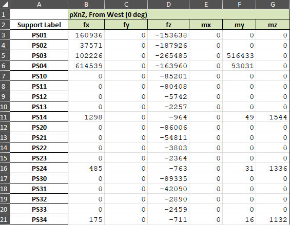

# piping_loads
Read load data from a spreadsheet and write to a file in SACS format.

## Load Case ID
Input list of load cases:

 - Sheet: Worksheet name
 - Column: Index of first column of data (e.g. for column D enter 4)
 - LOADCN: Load case ID
 - LOADLB: Load case description
 - LOAD_ID: Remark at the end of the LOAD line

## Data sheets
Joint labels are assumed to be in the first column, rows 3 to 21.
Data starts in column specified on Load Case ID sheet, rows 3 to 21, 6 columns wide.

