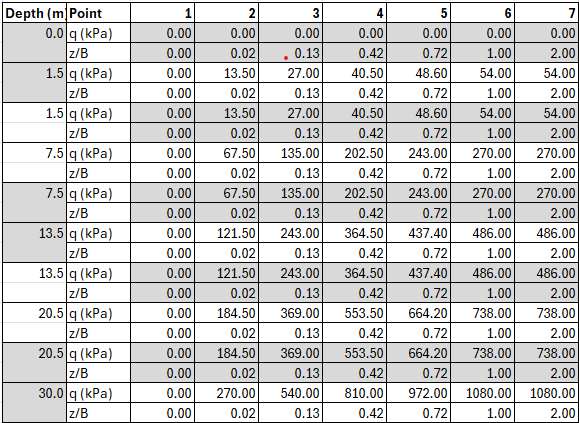

# soil_springs
Read T-Z, Q-Z and P-Y data from a spreadsheet and write to a file in SACS format.

## Data
Assumed data format is shown below.

The depth is rounded to the nearest 0.1m. If 2 rows are identical then the duplicates are dropped.

z/B value is multiplied by the input argument B (OD for plugged, WT for unplugged)

Spreadsheet units are assumed to be:

 - T-Z - kPa and mm
 - Q-Z - kPa and unitless
 - P-Y - kM/m and mm

